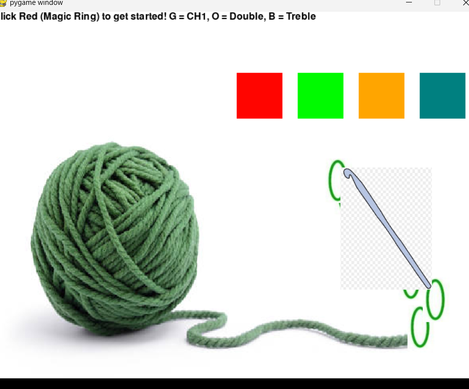

:warning: Everything between << >> needs to be replaced (remove << >> after replacing)

# << Project Title >>
## CS110 Final Project  << Semester, Year >>

## Team Members

<< List team member names >>

*** Alison Batz (one-woman team)

## Project Description

<< Give an overview of your project >>

*** Crochet game: Player uses buttons (based on 5 basic stitches) to create their own mini crochet project

## GUI Design

### Initial Design

### Final Design

(assets/gui_initial.jpg)(assets/menu_screen.jpg)

## Program Design

### Features

1. Menu - Start Button
2. Game Event - 5 Buttons that correspond to each stitch
3. Hook (that moves along with the stitch)

### Classes

- << You should have a list of each of your classes with a description >>
- Button Class (creates a button)
- Stitch Class (the image of the stitch, its intial position)
- Hook Class (image of the hook, linked movement to the stitches)

## ATP

| Step   |Procedure                  |Expected Results                   
|--------|:------------------------- |------------------------------------------------------
|1       | Press Start Button        | Starts the game                          
|2       |Click MR Button            | Creates an image of a oval (represents the magic ring) 
|3       |Click Chain 1 Button       | Creates an image of a single oval (represents one chain)                 
|4       |Click Double Stitch Button | Creates the images of a two ovals (represents two chains)
|5       |Click Treble Stitch Button | Creates the images of three ovals (represents three chains) 
etc...
